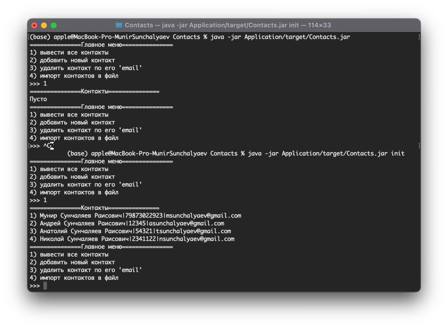
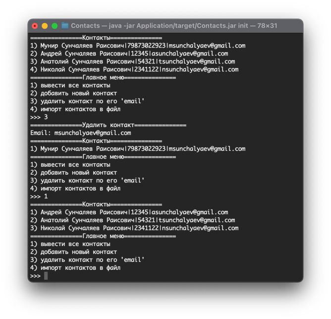
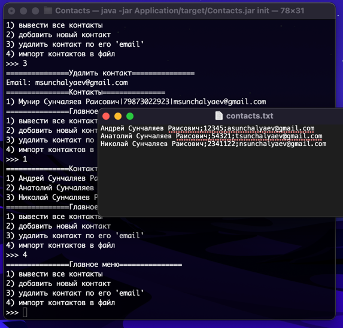

# Контакты
## Требования
Вам необходимо реализовать небольшое консольное приложение «Контакты». Сущность контакта представляет собой полное имя (fullName), номер телефона (phoneNumber) и адрес электронной почты (email).

1) Выводить все имеющиеся контакты пользователя в формате «Ф. И. О. | Номер телефона | Адрес электронной почты».
2) Добавлять новый контакт в список контактов. Формат ввода для обработки данных: Ф. И. О.; номер телефона; адрес электронной почты.
Пример пользовательского ввода: Иванов Иван Иванович; +890999999; someEmail@example.example.
3) Удалять контакт по email.
4) Сохранять имеющиеся контакты в файл в формате «Ф. И. О;номер телефона;адрес электронной почты».
Пример файла:
Иванов Иван Иванович;+890999999;someEmail@example.example
Смирнов Иван Иванович;+890999991;someEmail2@example.example
5) Использовать инициализацию хранилища с контактами через файл, если профиль приложения = init. Файл должен хранить произвольный набор контактов. Все контакты должны быть разделены переносом строки.
Пример файла:
Иванов Иван Иванович;+890999999;someEmail@example.example
Смирнов Иван Иванович;+890999991;someEmail2@example.example
Все запросы от пользователя должны быть обработаны корректно (без внештатного окончания работы), а ошибки ввода должны быть выведены пользователю на экран.

## Особенности реализации
Архитектура приложения - MVP: View представляет консольный вывод, Model - сервис для работы 
с данными, Presenter - координирует действия обоих. Все компоненты реализованы в соответствующих
модулях. В модуле Application располагается точка доступа с методом main, в модуле Commons-
объекты для разрешения циклических зависимостей между модулями.

При выборе 'импорт в файл' система записывает данные в выходной файл contacts.txt и помещает
его в корень проекта. Данный путь можно изменить Service/src/main/resources/application-service.properties,
что крайне не рекомендуется для отсутствия ошибок при запуске jar-архива в сторонней системе.

Системой запрещено создавать контакты с уже существующим номером.

В системе имеются два предустановленных профиля 'default' и 'init'. При активации последнего
перед запуском считываются данные расположенные в Service/src/main/resources/default-contacts.txt,
при активации первого - запуск с пустыми данными.

## Запуск
Перейти в корень и собрать проект:

```
mvn clean package
```

Запустить проект с профилем 'default':

```
java -jar Application/target/Contacts.jar
```

Запустить проект с профилем 'init':

```
java -jar Application/target/Contacts.jar init
```

## Примеры запуска
Запуск с разными профилями:



Удаление контакта:



Импорт контактов в файл:

